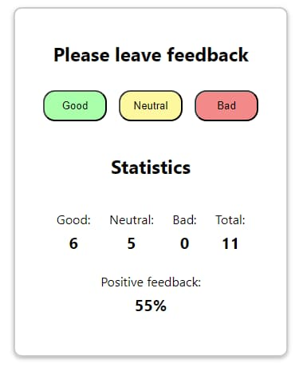
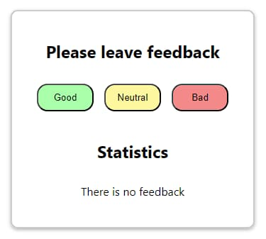

# Віджет відгуків реалізований з використанням React-хуків

## Опис:

Цей проект є простим віджетом для збору відгуків від користувачів, реалізованим
з використанням бібліотеки React та його хуків.

## Функціональні можливості:

- Користувач може залишити відгук, обравши одну з доступних опцій.
- Відображення статистики зібраних відгуків у вигляді кількості кожного типу
  відгуку та відсотка позитивних відгуків.
- Якщо відгуків немає, виводиться повідомлення про відсутність відгуків.

## Структура проекту:

- `App.jsx`: Основний компонент, що містить логіку віджета та відображає його
  інтерфейс.
- `Section.jsx`: Компонент-обгортка для секцій віджета.
- `FeedbackOptions.jsx`: Компонент, який відображає доступні опції відгуків та
  дозволяє користувачу обрати одну з них.
- `Statistics.jsx`: Компонент, який відображає статистику зібраних відгуків.
- `Notification.jsx`: Компонент, що відображає повідомлення про відсутність
  відгуків.

## Інструкції з встановлення та використання:

1. Склонуйте репозиторій на свій локальний комп'ютер.
2. Відкрийте проект у редакторі коду.
3. Відкрийте термінал та перейдіть до директорії проекту.
4. Виконайте команду `npm install`, щоб встановити залежності проекту.
5. Після встановлення залежностей виконайте команду `npm start`, щоб запустити
   проект у режимі розробки.
6. Відкрийте браузер та перейдіть за посиланням http://localhost:3000, щоб
   переглянути віджет в дії.

Насолоджуйтеся використанням.
